# 香港之行

**时间**：2024年7月9日~7月11日

**地点**：中华人民共和国香港特别行政区

## Day 1

一个人去了一趟香港，在去之前，通过我能了解到的信息，我对香港和国内其他城市的感觉是不一样的。
一直想着能有机会去看看，这次刚好因为一些事情去深圳出差和短居(参加liteyuki con和TriM con等)，所以就顺便去了香港。
首先是文化，香港是一个特别的地方，它既有中国的传统文化，又有西方的文化，这种文化的融合让香港成为了一个独特的城市。
其次就是出了名的MTR(港铁，也被戏称为抢铁)。

> 由于我是一个车迷，可能更多的会记录一些关于列车和地铁的事情。

前往香港的方式有多种，港铁东铁线，港铁广深港高速铁路，巴士，轮渡等等。出境的时候我选择了港铁动感号高铁，从深圳北站到[香港西九龙站](https://www.highspeed.mtr.com.hk/sc/guide/wek.html)
，大概30分钟左右。
然后在车上事先换好境外的SIM卡，这样到了香港就可以直接用了。可以购买短期的的纯流量卡，我选择的运营商是[中华电信](https://www.cht.com.tw/home/consumer)，价格还算合理。
到了西九龙站后，出站过程花了近40分钟，该口岸施行「一地两检」制度，理论上没有过中国边检之前都属于中国内地，要过中国海关和香港海关，加上人多，所以时间比较长。
> 大致流程是：出国铁闸机 -> 中国边检 -> 填写入境香港申请 -> 香港边检 -> 入境香港。

出站后搭乘[MTR](https://www.mtr.com.hk/)从佐敦(Jordan)站前往住宿地点安置行李。然后开始游玩，我住的酒店在旺角地段，交通便利，周围有很多购物中心和美食，很适合购物和吃货。
缺点也很明显，空间较小(是我们在深圳住的酒店的1/4)，费用高(但是香港确实物价高)。

> 搭乘[MTR]的过程中，从几个现象中可以感受出香港生活节奏的快，例如MTR的扶梯，不仅速度快到让人站不稳，而且对左急右慢的规则也是执行得很好，这一点在内地我去过的大部分城市都没有香港这么好。
> 其次就是列车的关门启动和高加速度，作为一个搭乘过大部分内地城市地铁的车迷看来，这个效率也是相当高了

安置好行李后，作为一个电子产品发烧友，来到楼下的一家小米之家看了一下小米的港版产品，个人感觉价格略高于内地，但是它们有Google服务，这点确实是遥遥领先了。

### 维多利亚港 Victoria Harbour

黄昏将至，我前往维多利亚港，这是香港的一个地标，也是香港的一个游览胜地，站在尖沙咀这里可以看到维多利亚港的夜景，还有香港岛的夜景，非常漂亮。

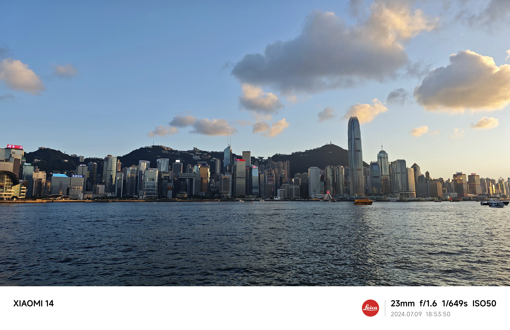

### 港岛 Island

沿着维多利亚港一路走到红磡，带有淡淡腥味的海风吹拂着脸庞，给人一种很舒服的感觉。Citywalk的夜景也是非常漂亮的.

> 而后我准备前往港岛。为了欣赏夜景我选择了双层巴士。从红磡下穿过海底隧道，

经中环前往金钟。下车后沿着铜锣湾继续Citywalk，这里的夜景也是非常漂亮的，而且有很多商场，适合购物。

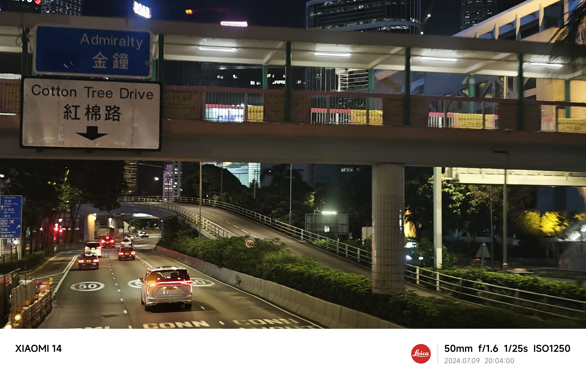

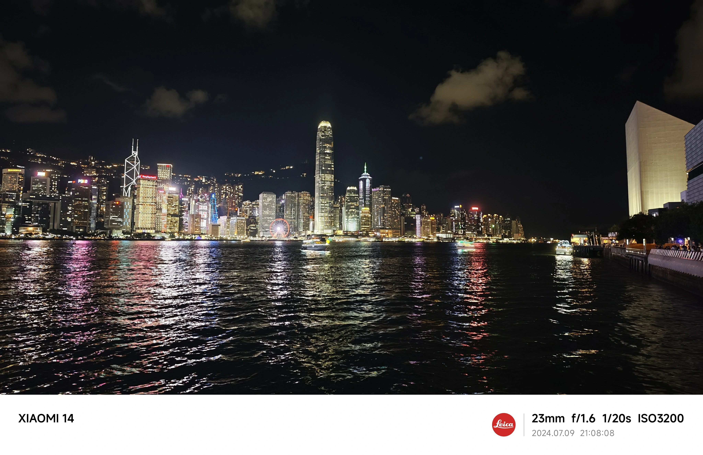

### 重庆大厦 Chungking Mansions

走完一圈后，时间已经较晚了，搭乘MTR回到了尖沙咀，我忘记了一件重要的事件，那就是吃东西。
重庆大厦在去香港前早有耳闻，本地人都觉得里面很乱且不安全，重庆大厦和重庆也没有什么关系，但是我还是怀着好奇心进去了。
里面一楼绝大部分人看起来来自东南亚，至少我是没有看到华人，但是吃的感觉也还不错，我用瘪嘴的英语点了一份咖喱饭，味道还不错，但是价格有点贵，且老板英语口音让人难以理解。
吃完后，我回到了酒店，洗漱后就睡了。

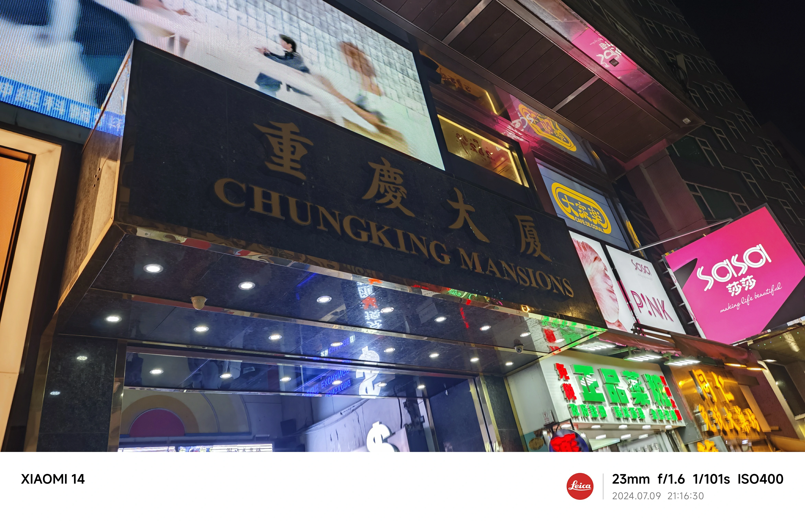

## Day 2

第二天早上，我起床后去了附近的一家茶餐厅吃早餐，这是香港的一种特色餐厅，里面的食物种类很多，价格也在可接受范围内，我随意地点了一份煎蛋三文治和一杯奶茶，味道还不错。

### 香港大学 HKU

- The University of Hong Kong

接下来就是前往港岛的[香港大学(HKU)](https://www.hku.hk/)，从HKU站出来以后，我就被这个校园的环境所吸引，最特别的一点是港大没有围墙，你根本感觉不到这是一个校园，而是一个公园。

香港也是一个山城，和我的家乡重庆有点像，港大里面各种建筑之间的廊桥和上下坡道对于我来说也算是比较熟悉的了。来回参观了一圈，然后在港大图书馆的大堂小憩了一会。继续前往下一个目的地

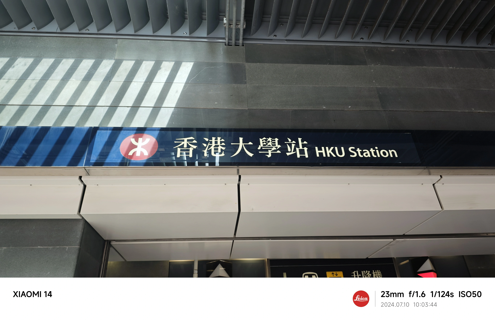

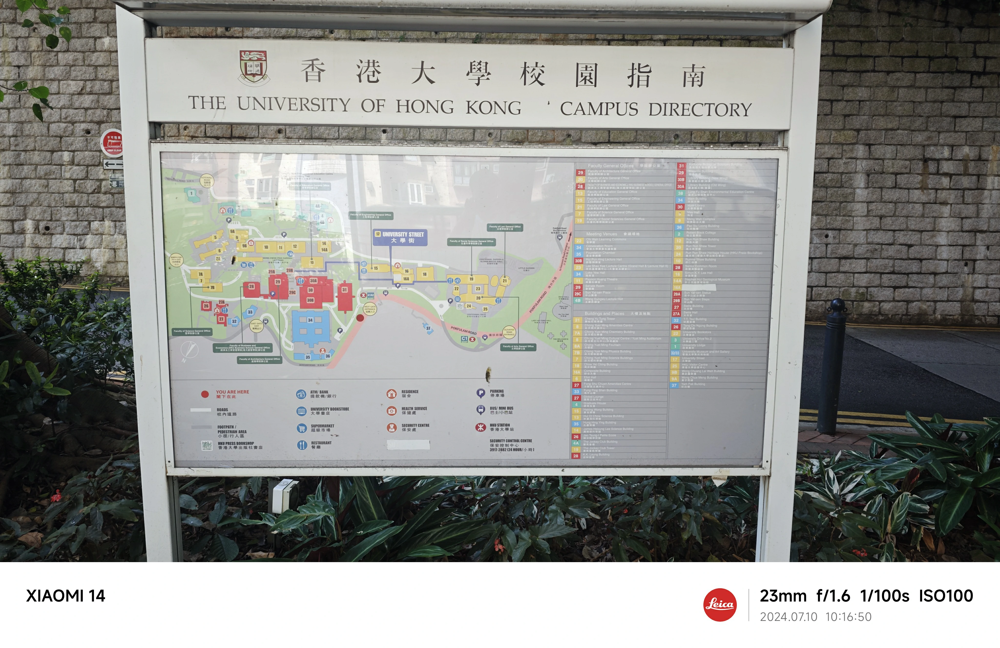

### 中环 Central

> 搭乘MTR岛线(Island Line)到中环(Central)站，出站后步行到达中环商场。

香港的金融中心，这里坐落有香港交易所，香港金融管理局等金融机构，是全港最繁忙的地段之一。穿梭在城市的高楼大厦之间，在这里可以感受到香港的繁华和现代化。

在中环商场中吃了一顿午餐，然后前往下一个目的地。

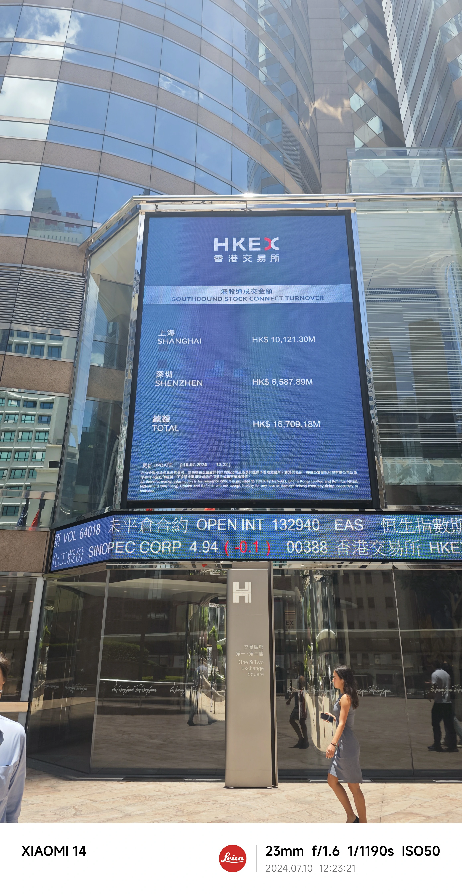

### 香港科技大学 HKUST

- The Hong Kong University of Science and Technology

> 港科大在西贡区的「深山老林」里面，需要从市区搭乘将军澳线(Tseung Kwan O Line)到达坑口(Hang Hau)站，然后转乘九巴或小巴到达科大闸口，再步行到达科大。

这所学校坐落在西贡的山腰上，整体坡度也很高，校园的环境非常好，空气清新，树木葱茏，靠近大海，风景优美。我在这里参观了一圈，由于天气过热，在校园里的咖啡厅喝了一杯咖啡休息了一会便准备返回市区。

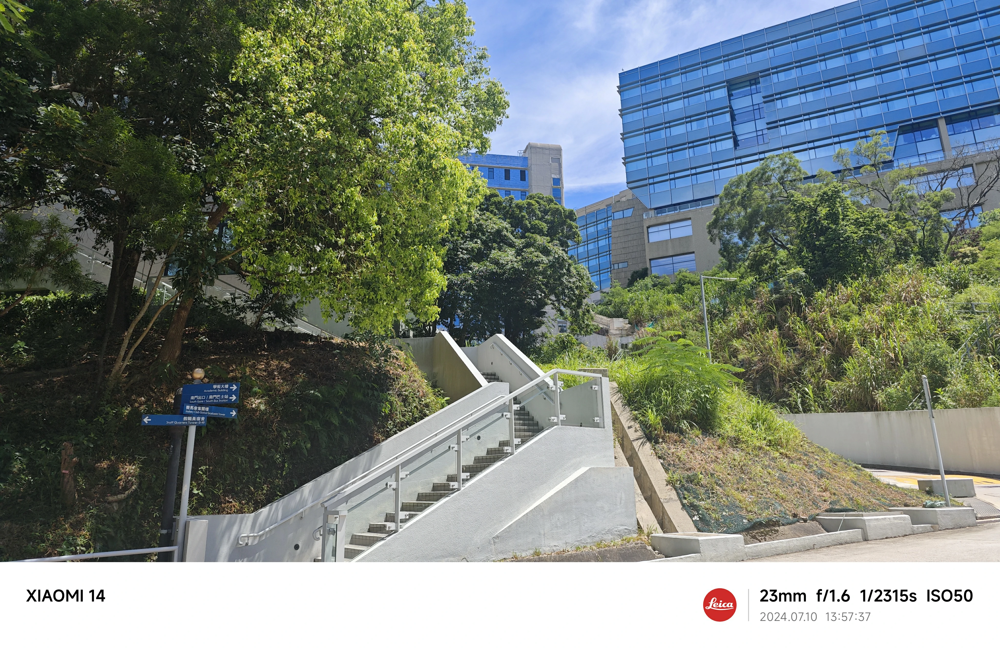
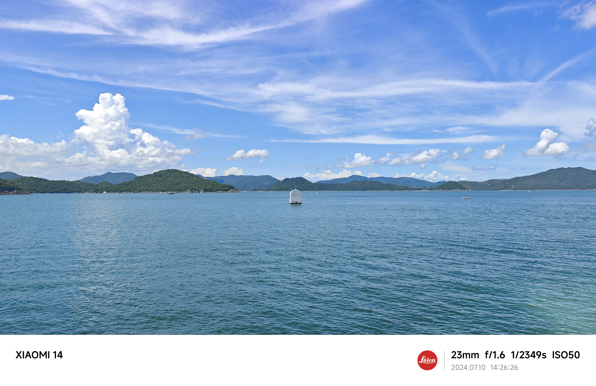
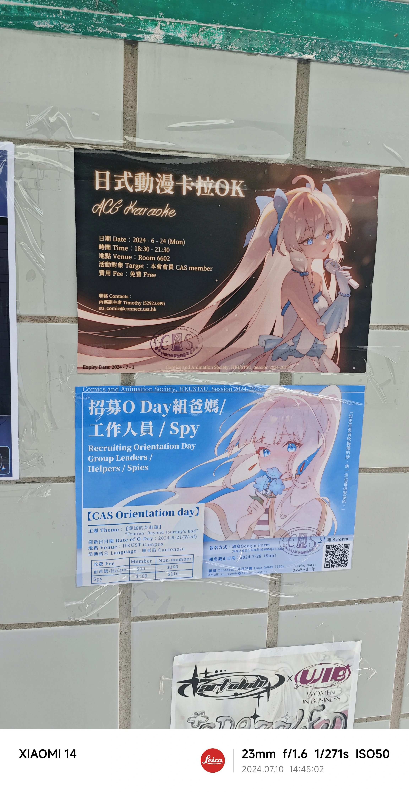

### 黄大仙祠 Wong Tai Sin Temple

作为香港的一个著名的道教庙宇，黄大仙祠是香港的一个旅游胜地，自然也是要去打卡的。(虽然我对宗教不是很感冒，但是作为一个旅行者，还是想要去了解一下当地的风俗文化)

> 搭乘MTR 观塘线(Kwun Tong Line)到黄大仙(Wong Tai Sin)站，出站后步行即可到达。

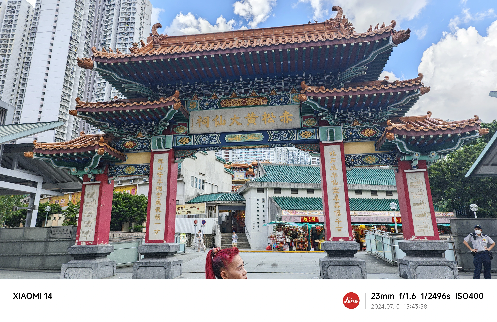

逛完黄大仙祠后，来到黄大仙中心简单逛了一下，吃了下晚饭，准备回深圳酒店休息。

> 从黄大仙站出发，于九龙塘换乘东铁线(East Rail Line)到达落马洲(Lok Ma Chau)站，然后过福田口岸回到深圳。

## 总结

这次香港之行，让我对香港有了更深的了解，也让我感受到了香港的独特魅力。香港是一个繁华的城市，也是一个充满活力的城市，这里的人们生活节奏快，但是也很有生活情调。香港的交通便利，购物中心众多，美食也很多，是一个适合旅游的城市。