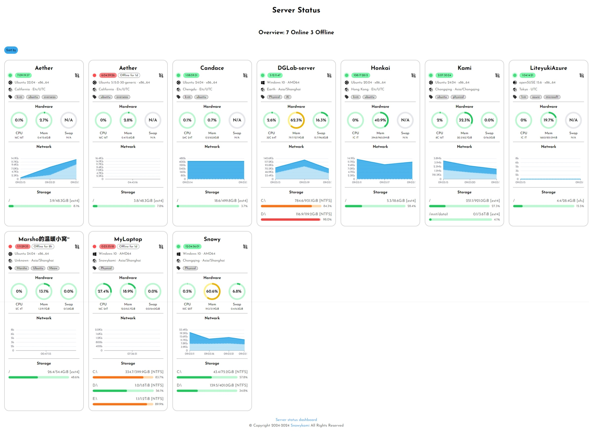

# Server status

## 项目地址

- 在服务端部署 [server-status-server](https://github.com/snowykami/server-status-server)
- 在被监视端部署 [server-status-client](https://github.com/snowykami/server-status-client)

## 效果图

