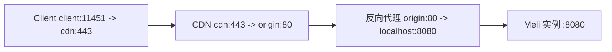

## 静态页面托管

### 这是什么

既然都点进来了相信你应该用过 GitHub Pages、Vercel、Cloudflare Pages 这类[PaaS](https://developer.aliyun.com/article/930304)静态页面托管服务，可以免费托管一些个人站点。
比如 hexo，vitepress，hugo 构建出的静态页面。而且有方便的工作流可以配合 GitHub Actions 等 CI/CD 工具进行自动化部署。

### 为什么要换掉

但是这些服务都是境外服务商提供的，在中国大陆避免不了一些奇奇怪怪的网络环境问题，例如解析失败，访问超时等。于是我一个朋友[释然](https://s1f.ren/)自建了一些 CDN 节点给我们用，我就在一些 GitHub Pages 前置了 CDN 业务，不出所料，访问速度确实很快，itdog 测试在大陆全命中缓存能跑全深绿色(<0.5s)。于是我们就这样用了一段时间。

几天后，朋友的 CDN 机房收到了 GitHub 的投诉，要求停止对 github.io 等其子域名的反向代理。看样子是不能继续在 GitHub Pages 前置 CDN 业务了，我为此还仔细阅读了 ToS，GitHub 是建议用户在页面前置 CDN 来减轻对 GitHub 服务器的负载的

> 如果你的站点超出这些使用配额，我们可能无法为你的站点提供服务；或者你可能收到来自 GitHub 支持 的礼貌电子邮件，建议降低站点对服务器影响的策略，包括将第三方内容分发网络 (CDN) 置于你的站点前，利用其他 GitHub 功能（如发行版）或转用可能更符合需求的其他托管服务。
> -- [GitHub 服务条款](https://docs.github.com/zh/pages/getting-started-with-github-pages/about-github-pages#github-pages-%E4%BD%BF%E7%94%A8%E9%99%90%E5%88%B6)

但是都收到投诉邮件了，担心引发后续问题，所以决定还是换个地方托管静态页面。我在网上找了许多开源的自托管静态页面软件，找到了许多 PaaS 产品，他们都可以自建，有的支持各种应用程序例如 Python，NodeJS，Go 等等，类似于 Vercel 这种业务。不过对于我来说，只想要一个轻量级的静态页面托管，不需要这么多功能，于是找到了[Meli](https://docs.meli.charlie-bravo.be/)，专注于静态页面托管的应用程序。

以下是我看中它的几个原因：

- 易于部署和快速上手
- 轻量，由 TypeScript 构建，没有我不需要的功能
- API 操作，并提供了 cli，可快速集成到现有前端项目的 CI/CD 中
- 控制台界面美观(这个是次要的)

## 安装

这边推荐用 Docker Compose 部署，一条命令即可搞定
在你想安装的目录下创建一个`docker-compose.yml`文件，内容如下：

```yaml
version: "3"

services:
  meli:
    image: getmeli/meli:beta
    ports:
      - 80:80 # 两个端口都根据需求改
      - 443:443
    environment:
      # no trailing slash !
      MELI_URL: https://meli.yourdomain.com # 改成你的域名
      MELI_MONGO_URI: mongodb://mongo:27017/meli
      # openssl rand -hex 32
      MELI_JWT_SECRET: changeMe # 随机生成一些字符串
      # https://docs.meli.sh/authentication
      MELI_USER: user # 改成你的用户名
      MELI_PASSWORD: changeMe # 随机生成一些字符串
      MELI_MAX_ORGS: 0 # 推荐设置为0，不限制创建组织数量
      MELI_HTTPS_AUTO: 0 # 如果你的ssl层在反向代理上，设置为0，不启用自带的ssl证书管理
    volumes:
      - ./data/sites:/sites
      - ./data/files:/files
      - ./data/caddy/data:/data
      - ./data/caddy/config:/config
    depends_on:
      - mongo

  mongo:
    image: mongo:4.2-bionic
    restart: unless-stopped
    volumes:
      - ./data/mongo:/data/db
```

然后在同一目录下运行以下命令：

```bash
sudo docker-compose up -d
```

容器创建后访问对应的域名和端口[http://localhost:80](http://localhost:80)就 OK，然后使用你设定的用户名和密码登录。

## 使用

### 配置域名

我个人倾向于在反向代理或者CDN层配置一切SSL，而不是在单个应用配置，因为大部分http业务都走的一个网关入口进入，然后按照主机名分流，内网通信无需使用https

首先在DNS中添加两条记录，IP(A/AAAA)也好，CNAME也好，最终这两个域名都要指向Meli实例

```bash
*.meli.yourdomain.com
meli.yourdomain.com
```



### 部署第一个静态网站

首先创建第一个组织，然后默认会有一个团队，在团队内创建第一个网站，拿到后面的网站ID(在Settings的Site ID处)，然后在Tokens中复制默认的first token，我们拿到这两个要素就可以迅速把本地的一个静态网站部署上去了

切换到网站根目录下(包含index.html的目录)

```bash
npx -p "@getmeli/cli" meli upload . \
    --url "https://meli.yourdomain.com" \   # 实例访问地址
    --site "xxxx" \   # 网站ID
    --token "xxxx" \    # 访问token
```

等待命令执行完毕，然后网站就部署成功了

访问https://{网站名称}.meli.yourdomain.com就可以访问到你的网站了
直接在Settings页面下添加，然后像上面一样配置dns指向Meli实例就OK

### 与Git在线仓库集成

如果你的Git储存库托管平台支持工作流，CI/CD等，直接把上述命令加到构建步骤后面就行，然后把"."改成你要上传的目录就行了

### 证书

本教程中默认证书是在CDN层或者反代层配置，在有多个web服务且使用主机名分流的情况下配置应用程序级别的证书意义不大