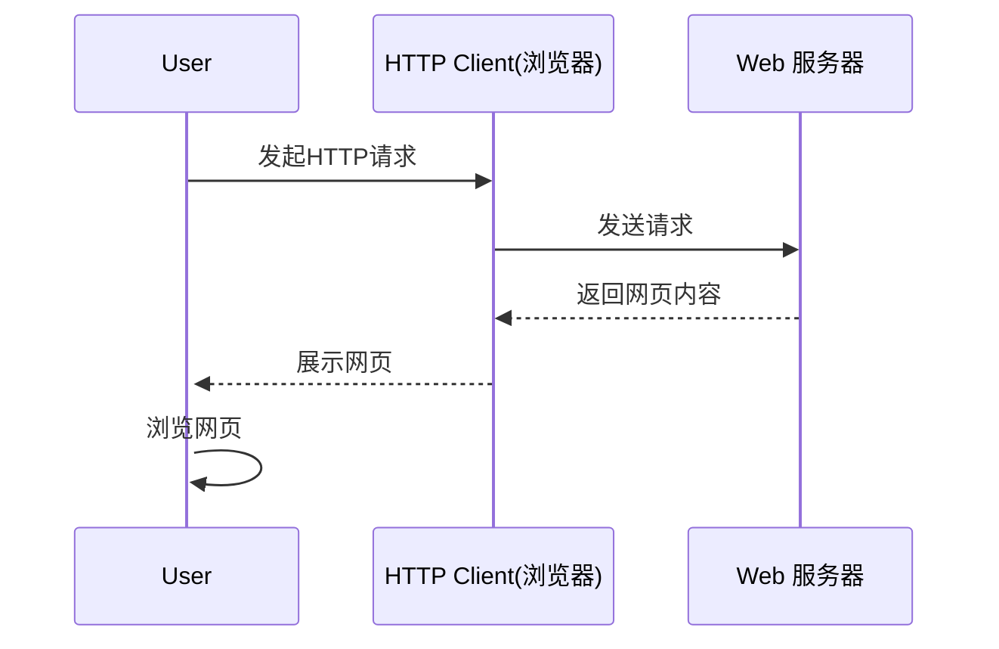
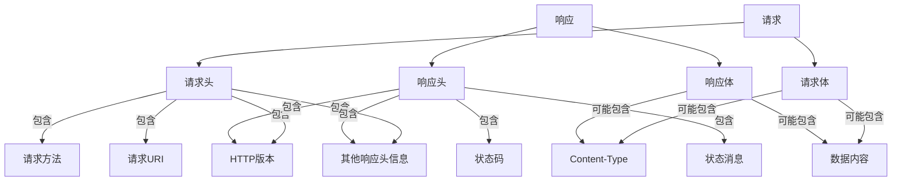

# 第五节课 - web编程及Hertz框架

## 前后端交互及爬虫

- 前端会将⾃⼰的js代码放在服务器中, ⽤⼾输⼊url，浏览器就可以拿到前端的代码执⾏。通常js代码内

会包含请求后端API的代码，这样前端就能拿到数据把界⾯撑起来。作为后端，我们要做的只是存储⽤

⼾数据，设计好接⼝返回对应的序列化数据（如json，xml，protobuf等）就⾏了。

- 我们有时候需要爬取网站的数据，这时候会编写一些爬虫程序进行操作，使用现有的库，传入我们的url和参数，发送请求就可以拿到对应的资源，可以是网页html，也可以是一些结构化数据


举个例⼦，我们打开b站, 右键后点击Inspect，并点击右⽅的Network，我们能够观察到这个⻚⾯请

求了哪些地址。




- 那大家想过这些后端服务器都是怎么运作的吗？


## Http协议、RESTful API及Web框架

### Http

**简约、可扩展、无状态**

超文本传输协议（Hypertext[ Transfer Protocol](https://baike.baidu.com/item/ Transfer Protocol/612755?fromModule=lemma_inlink)，HTTP）是一个简单的请求-响应协议，它通常运行在[TCP](https://baike.baidu.com/item/TCP/33012?fromModule=lemma_inlink)之上。它指定了客户端可能发送给服务器什么样的消息以及得到什么样的响应。请求和响应消息的头以[ASCII](https://baike.baidu.com/item/ASCII/309296?fromModule=lemma_inlink)形式给出；而消息内容则具有一个类似[MIME](https://baike.baidu.com/item/MIME/2900607?fromModule=lemma_inlink)的格式。超文本传输协议是一种用于分布式、协作式和超媒体信息系统的应用层协议，是万维网WWW（World Wide Web）的数据通信的基础。

网页前后端交互大都是通过http协议实现的，前端通过后端提供的http接口地址向后端上报(post)或拿取(get)需要的数据。前端是运作于用户浏览器之中的，后端则运行在专用服务器上，假如我们在登录框键入了账号密码，我们点击登录时，前端就会把账号密码传递给后端进行校验，校验通过后再进行一系列操作就可以登录成功。

**HTTPS**（Hypertext Transfer Protocol Secure：超文本传输安全协议）是一种透过计算机网络进行安全通信的传输协议。HTTPS 经由 HTTP 进行通信，但利用 SSL/TLS 来加密数据包。HTTPS 开发的主要目的，是提供对网站服务器的身份认证，保护交换数据的隐私与完整性。


<center>http请求示例</center>


<center>http响应示例</center>


#### 请求

##### **METHOD**(请求方法)

- GET: 请求指定资源的表示。使用 `GET` 的请求应该只用于请求数据，而不应该包含数据。

- POST: 发送数据给服务器。请求主体的类型由 [`Content-Type`](https://developer.mozilla.org/zh-CN/docs/Web/HTTP/Headers/Content-Type) 标头指定。

- DELETE: 用于删除指定的资源。

- PUT: 创建一个新的资源或用请求的有效载荷替换目标资源的表示。

    `PUT` 与 [`POST`](https://developer.mozilla.org/zh-CN/docs/Web/HTTP/Methods/POST) 方法的区别是，`PUT` 方法是幂等的：调用一次与连续调用多次效果是相同的（即没有副作用），而连续调用多次相同的 [`POST`](https://developer.mozilla.org/zh-CN/docs/Web/HTTP/Methods/POST) 方法可能会有副作用，比如多次提交同一订单。

> *更多方法请参阅[HTTP 请求方法 | MDN](https://developer.mozilla.org/zh-CN/docs/Web/HTTP/Methods/)*


我们使用go的内建库[net/http](https://pkg.go.dev/net/http)编写一个简单的响应GET /ping请求的代码

```bash
vim/nano main.go
```

```go
package main

import (
	"fmt"
	"net/http"
)

// ping 响应函数
func ping(w http.ResponseWriter, r *http.Request) {
	fmt.Fprintf(w, "pong!")
}

func main() {
	http.HandleFunc("/ping", ping)    // 创建路由
	http.ListenAndServe(":8000", nil) // 监听端口及启动服务
}
```

```bash
go run main.go
```

打开浏览器，访问http://localhost:8000/ping或http://127.0.0.1:8000/ping，相当于发起了一个请求GET http://127.0.0.1:8000/ping HTTP/1.1

可以看到响应文本`pong!`


##### **Query Parameters**(查询参数)

https://api.redrock.team/stu/search?gender=male&grade=2024

假设这是一个搜索学生的接口，其中gender和grade就是查询参数，其值为分别为male及2024，表示我们要查询2024级的男生，查询参数是放在URL里面的，通常适用于GET请求。但是设计接口时**不应该把过多的内容放到请求URL中**，因为它长度有限，过长会触发URL too long的错误，多余部分会被截断


##### Headers(请求头)

本质上是一堆键值对，包含了一些元数据。但是和请求相关的数据，例如请求的目标信息，参数一般不放在这里，请求头是**有大小限制**的

```bash
GET /index.html HTTP/1.1	# 方法、路径及协议版本
Host: www.redrock.team		# 指定请求主机名
User-Agent: Mozilla/5.0 (Windows NT 10.0; Win64; x64) AppleWebKit/537.36 (KHTML, like Gecko) Chrome/58.0.3029.110 Safari/537.3	# 客户端信息
Accept: text/html,application/xhtml+xml,application/xml;q=0.9,*/*;q=0.8	# 客户端可处理类型
Accept-Language: zh-CN,en;q=0.5	# 客户端偏好语言
Connection: keep-alive	# 客服连接类型
Upgrade-Insecure-Requests: 1	# 客户端希望将不安全的请求升级为安全的HTTPS请求
```

通常情况下会把基本认证也放到请求头中，这通常是一个复杂的字符串，用于服务端验证用户身份


##### Body(请求体)

###### form-data(表单数据)

表单数据是存放在请求体中的一系列键值对，在POST时，我们需要在其中传入请求所需要的参数，参数可以是**文本，二进制**，适合大量数据传输

例如：

```bash
POST /stu/login HTTP/1.1
Content-Type: multipart/form-data; boundary=----	# 表示我们会用表单传递数据
...	# 省略其他头部数据

------WebKitFormBoundary7MA4YWxkTrZu0gW	# 特殊分隔符
Content-Disposition: form-data; name="username"

2023114514
------WebKitFormBoundary7MA4YWxkTrZu0gW
Content-Disposition: form-data; name="password"

litiansuo114514
------WebKitFormBoundary7MA4YWxkTrZu0gW--
```

###### x-www-form-urlencoded(URL编码表单)

URL编码表单适合传输一些**量小**且**简单**的文本键值对数据

例如：

```bash
POST /stu/login HTTP/1.1
Content-Type: application/x-www-form-urlencoded
...	# 省略其他头部数据

username=2023114514&password=litiansuo114514
```

其他类型的请求体，如raw(原始)，binary(二进制)或GraphQL等，请自行查阅资料了解


#### Response

**状态码(status**/ˈsteɪtəs/ **code)：**

- 200 OK: 表明请求已经成功。默认情况下状态码为 200 的响应可以被缓存。
- 400 Bad Request: 请求语法错误、无效请求消息格式或者欺骗性请求路由），而无法或不会处理该请求。
- 401 Unauthorized: 缺乏身份凭据。
- 403 Forbidden: 拒绝访问（让我看看！不要啦）。
- 404 Not Found: 服务器无法找到所请求的资源。
- 500 Internal Server Error: 表示服务器端错误的响应状态码，比如服务端在处理请求时遇到了一些错误。

> *更多状态码请查看[HTTP响应状态码 | MDN](https://developer.mozilla.org/zh-CN/docs/Web/HTTP/Status)，在此不做赘述。*
>
> 更多有趣的状态码图片[HTTP CAT](https://http.cat/)

我们访问上文代码编写的一个响应程序，http://127.0.0.1:8000/hello，我们并未定义hello的路由，于是按照预期我们会得到一个`404 page not found`的响应，打开浏览器开发者工具，我们可以看到状态码是404。

###### Response Header(响应头)

提供关于服务器、响应体和请求本身的信息。也是一系列键值对，常见的有以下

- `Content-Type`：响应体的媒体类型（例如，`text/html`、`application/json`）。
- `Content-Length`：响应体的长度（以字节为单位）。
- `Server`：服务器软件的名称和版本。
- `Set-Cookie`：服务器用来设置客户端cookie的指令。
- `Cache-Control`：控制响应的缓存行为。
- `Expires`：响应过期的时间。
- `Last-Modified`：资源最后被修改的时间。
- `ETag`：资源的特定版本标识，用于缓存验证。
- `Location`：用于重定向的URL。

###### Response Body(响应体)

- 包含服务器返回给客户端的实际数据。
- 对于HTML页面，响应体将包含HTML代码；对于图片，响应体将包含图片的二进制数据；对于JSON API，响应体将包含JSON格式的数据。




<center>请求及响应结构图</center>

### RESTful API(了解即可)

REST全称是Representational State Transfer，中文意思是表述（编者注：通常译为表征）性状态转移。REST指的是一组架构约束条件和原则。" 如果一个架构符合REST的约束条件和原则，我们就称它为RESTful架构。

**URL中只使用名词来定位资源，用HTTP协议里的动词（GET、POST、PUT、DELETE、PATCH、HEAD、OPTIONS、TRACE、CONNECT）来实现资源的增删改查操作。与技术无关，这是一种软件架构风格**（实际开发中可能更多的是POST和GET）

例如：pass.redrock.team 指向我们的后端服务器

- GET	 https://pass.redrock.team/user_id=114514    // 获取id为114514的用户信息
- DELETE  https://pass.redrock.team/user_id=114514    // 删除id为114514的用户
- POST        https://pass.redrock.team/user_id=114514    // 新增id为114514的用户


### Web框架 - Gin及Hertz

Go标准库提供了net/http包，为什么还会有Gin和Hertz等这些第三方的web框架出现呢，因为net/http提供了最基本的构建web应用的功能，使得构建应用变得简单和通用，但是在构建大型应用或分布式应用时，就显得有些力不从心了，一些完善的第三方库有利于和其他服务集成，且提供了更好的性能优化。

- Gin是一个使用Go语言开发的Web框架。 它提供类似Martini的API，但性能更佳，速度提升高达40倍。 如果你是性能和高效的追求者, 你会爱上 Gin。
- Hertz[həːts] 是一个 Golang 微服务 HTTP 框架，在设计之初参考了其他开源框架 [fasthttp](https://github.com/valyala/fasthttp)、[gin](https://github.com/gin-gonic/gin)、[echo](https://github.com/labstack/echo) 的优势， 并结合**字节跳动**内部的需求，使其具有高易用性、高性能、高扩展性等特点，目前在字节跳动内部已广泛使用。 如今越来越多的**微服务**选择使用 Golang，如果对微服务性能有要求，又希望框架能够充分满足内部的可定制化需求，Hertz 会是一个不错的选择。


<center>四种框架benchmark统计，Hertz 高性能ですから！</center>

> 我们网校的后端服务是一个群微服务构成的，web框架选择CloudWeGo/Hertz是为了和CloudWeGo生态的其他框架和一些微服务工具链进行良好的集成，以及利用前人设计好的一些轮子，来帮我们快速地实现业务所需，降低维护成本

由于Hertz和Gin的使用都差不多，考虑到网校项目需求，我们优先讲Hertz的使用，同时会提及Gin的使用

Gin的基本使用

```go
package main

import "github.com/gin-gonic/gin"

func main() {
	r := gin.Default()
	r.GET("/ping", func(c *gin.Context) {
		c.JSON(200, gin.H{
			"message": "pong",
		})
	})	// 定义一个/ping路由，支持GET方法
	r.Run() // 监听并在 0.0.0.0:8080 上启动服务
}
```


Hertz的基本使用

```go
package main

import (
    "context"

    "github.com/cloudwego/hertz/pkg/app"
    "github.com/cloudwego/hertz/pkg/app/server"
    "github.com/cloudwego/hertz/pkg/common/utils"
    "github.com/cloudwego/hertz/pkg/protocol/consts"
)

func main() {
    h := server.Default()

    h.GET("/ping", func(ctx context.Context, c *app.RequestContext) {
            c.JSON(consts.StatusOK, utils.H{"message": "pong"})
    })	// 定义一个/ping路由，支持GET方法

    h.Spin()	// 启动监听，Hertz默认是8888端口
}
```

运行上述两段代码，对服务地址加上/ping进行访问，都会响应一个json

```json
{
    "message": "pong"
}
```

至此，我们已经编写了一个简单的接口，实现了一个状态检测

Gin的HandlerFunc接受一个上下文，而Hertz的HandlerFunc接受两个上下文

```go
type HandlerFunc func(c context.Context, ctx *RequestContext)	//	Hertz的处理函数签名
```

上下文包含了当前请求中的所有信息，`context.Context` 与 `RequestContext` 都有存储值的能力，但是储值生命周期不同

ctx *RequestContext储存了请求级别的变量，请求结束回收，协程不安全，传递为指针对象

c context.Context可以在多个HandlerFunc间顺序传递，协程安全


#### 教学实践：编写一个简易用户管理系统

内存储存，结束消除数据，仅用于教学

需要实现的接口

- POST /register（用户注册，在请求体中用表单传入username和password，返回注册状态）
- POST /login（用户登录，在请求体中用表单传入username和password，返回一个token给用户用于维持会话）
- POST /profile（修改用户属性，需要鉴权，在表单中带上需要修改的属性）
- GET /user（获取用户列表或单个用户，需要鉴权，在查询参数中带上用户名）

鉴权中间件HandlerFunc

vscode教学

```go
// 入口文件 main.go
package main

import (
	"context"

	"github.com/cloudwego/hertz/pkg/app"
	"github.com/cloudwego/hertz/pkg/app/server"
	"github.com/cloudwego/hertz/pkg/common/utils"
	"github.com/cloudwego/hertz/pkg/protocol/consts"
)

func main() {
	h := server.Default()

	h.GET("/ping", func(ctx context.Context, c *app.RequestContext) {
		c.JSON(consts.StatusOK, utils.H{"message": "pong"})
	}) // 定义一个/ping路由，支持GET方法

	h.POST("/register", Register)
	h.POST("/login", Login)
	h.POST("/profile", Auth, Profile)	// 该方法需要鉴权，所以我们在前面传一个鉴权HandlerFunc，在大型项目中我们可以使用Group进行分组，然后使用标准中间件操作
	h.GET("/user", Auth, User)

	h.Spin() // 启动监听，Hertz默认是8888端口
}
```

```go
// api.go
package main	// 同属main包

import (
	"context"

	"github.com/cloudwego/hertz/pkg/app"
)

// Register 注册函数
func Register(c context.Context, ctx *app.RequestContext) {
	// 注册逻辑...
}

// Login 登录函数
func Login(c context.Context, ctx *app.RequestContext) {}

// Profile 个人信息函数
func Profile(c context.Context, ctx *app.RequestContext) {}

// User 获取用户函数
func User(c context.Context, ctx *app.RequestContext) {}

// Auth 认证函数
func Auth(c context.Context, ctx *app.RequestContext) {
	// 鉴权函数
    if 鉴权成功 {
        ctx.Next(c)	// 继续响应后面的处理函数
    } else {
        ctx.Abort()	// 放弃
    }
}

```

##### 会话维持 - JWT(Json Web Token)

最开始提到http是无状态的，这里的状态并不是状态码，而是指会话状态，http是请求才有响应。

如果每一次需要验证身份的操作都需要带上账号密码作为参数，把账号和密码储存在浏览器，这样做虽然可行，但是麻烦且安全性较低。有没有一种更高效的方式呢。

这时候就要请出我们的token(令牌)来进行身份验证了，在每次登录后，服务端下发一个用特定加密算法生成的token，可以为一串特定算法生成的字符串，该token可以用来验证用户身份，且存在一个有效期。借助cookie或者localstorage等功能储存在浏览器，在前端每次需要向后端发送需要鉴权的请求时在**请求头**基本鉴权带上该token即可实现身份认证，有效期过后便会提示用户重新登陆。

jwt，顾名思义它是由json构成的，Hertz生态提供了一个jwt包用于管理jwt，当然也可以使用许多第三方的jwt库来进行token生成，你也可以使用自己的token生成算法。token算法和服务之间是没有耦合的，你可以使用任何现代化的鉴权方式。

> vscode代码讲解`jwt.go`


