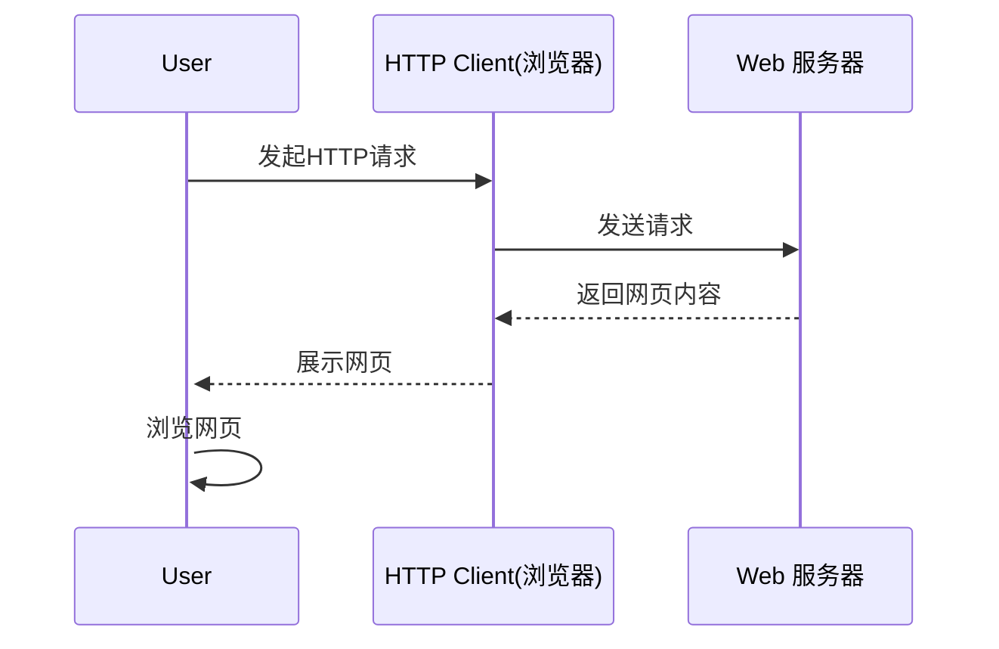
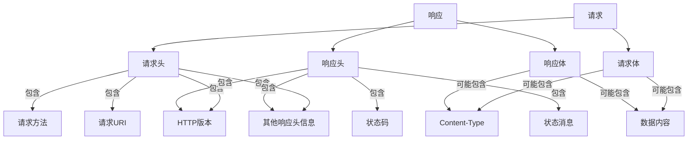

# 第五节课 - web编程及Hertz框架

Go被设计为服务端应用程序开发语言，由于其天生的易于并发优势，适合用于网络编程；逐渐成为云原生，微服务领域的主导语言，许多应用被设计之初就考虑在“云”上运行。因此web编程是Go学习过程中比较重要且实用的一步

## 前后端交互及爬虫

- 前端会将⾃⼰的Javascript代码放在服务器中, ⽤⼾输⼊URL，浏览器就可以拿到前端的代码执⾏。通常js代码内

会包含请求后端API的代码，这样前端就能拿到数据把界⾯撑起来。作为后端，我们要做的只是存储⽤

⼾数据，设计好接⼝返回对应的序列化数据（如json，xml，protobuf等）就⾏了。

- 我们有时候需要爬取网站的数据，这时候会编写一些爬虫程序进行操作，使用现有的库，传入我们的url和参数，发送请求就可以拿到对应的资源，可以是网页html，也可以是一些结构化数据


举个例⼦，我们打开b站, 右键后点击Inspect，并点击右⽅的Network，我们能够观察到这个⻚⾯请

求了哪些地址。




- 那大家想过这些后端服务器都是怎么运作的吗？


## Http协议、RESTful API及Web框架

### Http

**简约、可扩展、无状态**

超文本传输协议（Hypertext[ Transfer Protocol](https://baike.baidu.com/item/ Transfer Protocol/612755?fromModule=lemma_inlink)，HTTP）是一个简单的请求-响应协议，它通常运行在[TCP](https://baike.baidu.com/item/TCP/33012?fromModule=lemma_inlink)之上。它指定了客户端可能发送给服务器什么样的消息以及得到什么样的响应。请求和响应消息的头以[ASCII](https://baike.baidu.com/item/ASCII/309296?fromModule=lemma_inlink)形式给出；而消息内容则具有一个类似[MIME](https://baike.baidu.com/item/MIME/2900607?fromModule=lemma_inlink)的格式。超文本传输协议是一种用于分布式、协作式和超媒体信息系统的应用层协议，是万维网WWW（World Wide Web）的数据通信的基础。

网页前后端交互大都是通过http协议实现的，前端通过后端提供的http接口地址向后端上报(post)或拿取(get)需要的数据。前端是运作于用户浏览器之中的，后端则运行在专用服务器上，假如我们在登录框键入了账号密码，我们点击登录时，前端就会把账号密码传递给后端进行校验，校验通过后再进行一系列操作就可以登录成功。

**HTTPS**（Hypertext Transfer Protocol Secure：超文本传输安全协议）是一种透过计算机网络进行安全通信的传输协议。HTTPS 经由 HTTP 进行通信，但利用 SSL/TLS 来加密数据包。HTTPS 开发的主要目的，是提供对网站服务器的身份认证，保护交换数据的隐私与完整性。


<center>http请求示例</center>


<center>http响应示例</center>


#### Request 请求

##### **METHOD**(请求方法)

- GET: 请求指定资源的表示。使用 `GET` 的请求应该只用于请求数据，而不应该包含数据。

- POST: 发送数据给服务器。请求主体的类型由 [`Content-Type`](https://developer.mozilla.org/zh-CN/docs/Web/HTTP/Headers/Content-Type) 标头指定。

- DELETE: 用于删除指定的资源。

- PUT: 创建一个新的资源或用请求的有效载荷替换目标资源的表示。

    `PUT` 与 [`POST`](https://developer.mozilla.org/zh-CN/docs/Web/HTTP/Methods/POST) 方法的区别是，`PUT` 方法是幂等的：调用一次与连续调用多次效果是相同的（即没有副作用），而连续调用多次相同的 [`POST`](https://developer.mozilla.org/zh-CN/docs/Web/HTTP/Methods/POST) 方法可能会有副作用，比如多次提交同一订单。

> *更多方法请参阅[HTTP 请求方法 | MDN](https://developer.mozilla.org/zh-CN/docs/Web/HTTP/Methods/)*


我们使用go的内建库[net/http](https://pkg.go.dev/net/http)编写一个简单的响应GET /ping请求的代码

```bash
vim/nano main.go
```

```go
package main

import (
	"fmt"
	"net/http"
)

// ping 响应函数
func ping(w http.ResponseWriter, r *http.Request) {
	fmt.Fprintf(w, "pong!")
}

func main() {
	http.HandleFunc("/ping", ping)    // 创建路由
	http.ListenAndServe(":8000", nil) // 监听端口及启动服务
}
```

```bash
go run main.go
```

打开浏览器，访问http://localhost:8000/ping或http://127.0.0.1:8000/ping，相当于发起了一个请求GET http://127.0.0.1:8000/ping HTTP/1.1

可以看到响应文本`pong!`


##### **Query Parameters**(查询参数)

https://api.redrock.team/stu/search?gender=male&grade=2024

假设这是一个搜索学生的接口，其中gender和grade就是查询参数，其值为分别为male及2024，表示我们要查询2024级的男生，查询参数是放在URL里面的，通常适用于GET请求。但是设计接口时**不应该把过多的内容放到请求URL中**，因为它长度有限，过长会触发URL too long的错误，多余部分会被截断，当需要传递大量参数时考虑将这些东西放到请求体中


##### Headers(请求头)

本质上是一堆键值对，包含了一些元数据。但是和请求相关的数据，例如请求的目标信息，参数一般不放在这里，请求头是**有大小限制**的

```bash
GET /index.html HTTP/1.1	# 方法、路径及协议版本
Host: www.redrock.team		# 指定请求主机名
User-Agent: Mozilla/5.0 (Windows NT 10.0; Win64; x64) AppleWebKit/537.36 (KHTML, like Gecko) Chrome/58.0.3029.110 Safari/537.3	# 客户端信息
Accept: text/html,application/xhtml+xml,application/xml;q=0.9,*/*;q=0.8	# 客户端可处理类型
Accept-Language: zh-CN,en;q=0.5	# 客户端偏好语言
Connection: keep-alive	# 客服连接类型
Upgrade-Insecure-Requests: 1	# 客户端希望将不安全的请求升级为安全的HTTPS请求
```

通常情况下会把基本认证也放到请求头中，这通常是一个复杂的字符串，用于服务端验证用户身份


##### Body(请求体)

请求体由Content-Type指定类型，下面主要讲一些接口编写中常用的类型

1. **Text 类型**：
    - `text/html`：HTML文档。
    - `text/plain`：纯文本。
    - `text/xml`：XML文档。
    - `text/css`：层叠样式表（CSS）。
    - `text/javascript`：JavaScript代码。
2. **Image 类型**：
    - `image/jpeg`：JPEG图片。
    - `image/png`：PNG图片。
    - `image/gif`：GIF图片。
    - `image/svg+xml`：SVG图片。
3. **Audio 类型**：
    - `audio/mpeg`：MPEG音频。
    - `audio/wav`：WAV音频。
    - `audio/ogg`：OGG音频。
4. **Video 类型**：
    - `video/mp4`：MP4视频。
    - `video/webm`：WebM视频。
    - `video/ogg`：OGG视频。
5. **Application 类型**：
    - `application/json`：JSON数据。
    - `application/xml`：XML数据。
    - `application/pdf`：PDF文档。
    - `application/zip`：ZIP压缩文件。
    - `application/javascript`：JavaScript代码。
    - `application/x-www-form-urlencoded`：表单数据，以键值对形式编码。
6. **Multipart 类型**：
    - `multipart/form-data`：用于表单数据中包含文件上传的情景，数据被拆分成多个部分，每个部分包含自己独立的头部信息。
7. **其他类型**：
    - `message/rfc822`：电子邮件消息。
    - `model/vnd.gltf+json`：3D模型数据。

通常在编写接口时，我们用的最多的是json/xml/x-www-form-urlencoded/form-data这几种类型，需要传输文件时可能也会用到媒体类型

###### form-data(表单数据)

表单数据是存放在请求体中的一系列键值对，在POST时，我们需要在其中传入请求所需要的参数，参数可以是**文本，二进制**，适合大量数据传输

例如：

```bash
POST /stu/login HTTP/1.1
Content-Type: multipart/form-data; boundary=----	# 表示我们会用表单传递数据
...	# 省略其他头部数据

------WebKitFormBoundary7MA4YWxkTrZu0gW	# 特殊分隔符
Content-Disposition: form-data; name="username"

2023114514
------WebKitFormBoundary7MA4YWxkTrZu0gW
Content-Disposition: form-data; name="password"

litiansuo114514
------WebKitFormBoundary7MA4YWxkTrZu0gW--
```

###### x-www-form-urlencoded(URL编码表单)

URL编码表单适合传输一些**量小**且**简单**的文本键值对数据

例如：

```bash
POST /stu/login HTTP/1.1
Content-Type: application/x-www-form-urlencoded
...	# 省略其他头部数据

username=2023114514&password=litiansuo114514
```

其他类型的请求体，如raw(原始)，binary(二进制)或GraphQL等，请自行查阅资料了解


#### Response 响应

**状态码(status**/ˈsteɪtəs/ **code)：**

- 200 OK: 表明请求已经成功。默认情况下状态码为 200 的响应可以被缓存。
- 400 Bad Request: 请求语法错误、无效请求消息格式或者欺骗性请求路由），而无法或不会处理该请求。
- 401 Unauthorized: 缺乏身份凭据。
- 403 Forbidden: 拒绝访问（让我看看！不要啦）。
- 404 Not Found: 服务器无法找到所请求的资源。
- 500 Internal Server Error: 表示服务器端错误的响应状态码，比如服务端在处理请求时遇到了一些错误。

> *更多状态码请查看[HTTP响应状态码 | MDN](https://developer.mozilla.org/zh-CN/docs/Web/HTTP/Status)，在此不做赘述。*
>
> 更多有趣的状态码图片[HTTP CAT](https://http.cat/)

我们访问上文代码编写的一个响应程序，http://127.0.0.1:8000/hello，我们并未定义hello的路由，于是按照预期我们会得到一个`404 page not found`的响应，打开浏览器开发者工具，我们可以看到状态码是404。

###### Response Header(响应头)

提供关于服务器、响应体和请求本身的信息。也是一系列键值对，常见的有以下

- `Content-Type`：响应体的媒体类型（例如，`text/html`、`application/json`）。
- `Content-Length`：响应体的长度（以字节为单位）。
- `Server`：服务器软件的名称和版本。
- `Set-Cookie`：服务器用来设置客户端cookie的指令。
- `Cache-Control`：控制响应的缓存行为。
- `Expires`：响应过期的时间。
- `Last-Modified`：资源最后被修改的时间。
- `ETag`：资源的特定版本标识，用于缓存验证。
- `Location`：用于重定向的URL。

###### Response Body(响应体)

- 包含服务器返回给客户端的实际数据。
- 对于HTML页面，响应体将包含HTML代码；对于图片，响应体将包含图片的二进制数据；对于JSON API，响应体将包含JSON格式的数据。




<center>请求及响应结构图</center>

#### http接口测试工具

我们在编写好一系列接口后，如何测试接口是否工作正常

- 使用现代化的接口测试工具例如Postman，Apifox等。

- 使用Python等比较适合编写爬虫的语言，编写一段脚本模拟用户操作，然后检查响应是否符合预期。

**测试是项目开发过程中不可缺少的一环，可以在项目上线前检查出潜在的问题并及时修复，这个是很重要的！**

<!--  -->

##### 使用Go编写代码发送请求

```go
package main

import (
	"fmt"
	"io/ioutil"
	"net/http"
)

func main() {
	// 定义请求的URL
    url := "http://127.0.0.1:8888/ping"

	// 创建一个HTTP客户端
	client := &http.Client{}

	// 发送GET请求
	resp, err := client.Get(url)
	if err != nil {
		panic(err)
	}
	defer resp.Body.Close() // 确保在函数返回时关闭响应体

	// 读取响应内容
	body, err := ioutil.ReadAll(resp.Body)
	if err != nil {
		panic(err)
	}

	// 打印响应内容
	fmt.Println(string(body))
}
```


### RESTful API(了解即可)

REST全称是Representational State Transfer，中文意思是表述（编者注：通常译为表征）性状态转移。REST指的是一组架构约束条件和原则。" 如果一个架构符合REST的约束条件和原则，我们就称它为RESTful架构。

**URL中只使用名词来定位资源，用HTTP协议里的动词（GET、POST、PUT、DELETE、PATCH、HEAD、OPTIONS、TRACE、CONNECT）来实现资源的增删改查操作。与技术无关，这是一种软件架构风格**（实际开发中可能更多的是POST和GET）

例如：pass.redrock.team 指向我们的后端服务器

- GET	 https://pass.redrock.team/user_id=114514    // 获取id为114514的用户信息
- DELETE  https://pass.redrock.team/user_id=114514    // 删除id为114514的用户
- POST        https://pass.redrock.team/user_id=114514    // 新增id为114514的用户


### Web框架 - Gin及Hertz

Go标准库提供了net/http包，为什么还会有Gin和Hertz等这些第三方的web框架出现呢，因为net/http提供了最基本的构建web应用的功能，使得构建应用变得简单和通用，但是在构建大型应用或分布式应用时，就显得有些力不从心了，一些完善的第三方库有利于和其他服务集成，且提供了更好的性能优化。

- Gin是一个使用Go语言开发的Web框架。 它提供类似Martini的API，但性能更佳，速度提升高达40倍。 如果你是性能和高效的追求者, 你会爱上 Gin。
- Hertz[həːts] 是一个 Golang 微服务 HTTP 框架，在设计之初参考了其他开源框架 [fasthttp](https://github.com/valyala/fasthttp)、[gin](https://github.com/gin-gonic/gin)、[echo](https://github.com/labstack/echo) 的优势， 并结合**字节跳动**内部的需求，使其具有高易用性、高性能、高扩展性等特点，目前在字节跳动内部已广泛使用。 如今越来越多的**微服务**选择使用 Golang，如果对微服务性能有要求，又希望框架能够充分满足内部的可定制化需求，Hertz 会是一个不错的选择。


<center>四种框架benchmark统计，Hertz 高性能ですから！</center>

> 我们网校的后端服务是一个群微服务构成的，web框架选择CloudWeGo/Hertz是为了和CloudWeGo生态的其他框架和一些微服务工具链进行良好的集成，以及利用前人设计好的一些轮子，来帮我们快速地实现业务所需，降低维护成本

由于Hertz和Gin的使用都差不多，考虑到网校项目需求，我们优先讲Hertz的使用，同时会提及Gin的使用

Gin的基本使用

```go
package main

import "github.com/gin-gonic/gin"

func main() {
	r := gin.Default()
	r.GET("/ping", func(c *gin.Context) {
		c.JSON(200, gin.H{
			"message": "pong",
		})
	})	// 定义一个/ping路由，支持GET方法
	r.Run() // 监听并在 0.0.0.0:8080 上启动服务
}
```


Hertz的基本使用

```go
package main

import (
    "context"

    "github.com/cloudwego/hertz/pkg/app"
    "github.com/cloudwego/hertz/pkg/app/server"
    "github.com/cloudwego/hertz/pkg/common/utils"
    "github.com/cloudwego/hertz/pkg/protocol/consts"
)

func main() {
    h := server.Default()	// 创建engine

    h.GET("/ping", func(ctx context.Context, c *app.RequestContext) {
            c.JSON(consts.StatusOK, utils.H{"message": "pong"})
    })	// 定义一个/ping路由，支持GET方法

    h.Spin()	// 启动监听，Hertz默认是8888端口
}
```

运行上述两段代码，对服务地址加上/ping进行访问，都会响应一个json

```json
{
    "message": "pong"
}
```

至此，我们已经编写了一个简单的接口，实现了一个状态检测

Gin的HandlerFunc接受一个上下文，而Hertz的HandlerFunc接受两个上下文

*HandlerFunc：用于处理包含这些请求的上下文的函数。*

```go
type HandlerFunc func(c context.Context, ctx *RequestContext)	//	Hertz的处理函数签名
```

> go的函数签名仅规定了传参的顺序，没有规定参数名，只要类型是匹配的就可以，所以说你可以用`func MyHandler(c context.Context, ctx *RequestContext)`或`func MyHandler(ctx context.Context, c *RequestContext)`来进行HandlerFunc及中间件们的定义，本课中使用前者（由于Hertz文档和demo比较混乱，建议写开发中自行统一一种写法）

上下文包含了当前请求中的所有信息，`context.Context` 与 `RequestContext` 都有存储值的能力，但是储值生命周期不同

ctx *RequestContext储存了请求级别的变量，请求结束回收，协程不安全，传递为指针对象

c context.Context可以在多个HandlerFunc间顺序传递，协程安全，一般用这个在多个HandlerFunc中进行储值传递

#### 请求上下文及其操作

上面提到了请求和响应中都包含了非常多的信息，那么我们如何从请求头，请求体中拿取我们需要的部分呢

ctx *RequestContext包含了请求的所有信息，并且提供了一系列方法可供调用

##### 拿取URL查询参数

假如我们有一个接口`GET https://127.0.0.1:8888/search?stu_id={学号}`，用学号查询一个学生的信息

我们可以使用```ctx.Query(key string)```或```ctx.GetQuery(key string)```来拿取这个查询参数**字符串**，

**函数签名如下**（函数签名（Function Signature）指的是函数的名称、参数列表和返回类型）

```
func (ctx *app.RequestContext) Query(key string) string
func (ctx *app.RequestContext) GetQuery(key string) (string, bool)
```

**使用示例**

```go
func SearchStudent(c context.Context, ctx *app.RequestContext) {
    // 该函数会返回stu_id的值，若不存在则返回空字符串""
	id := ctx.Query("stu_id")	
    ...
    // 该函数返回值的第一个值与上个函数中一致，若不存在第二个值为false，若需要严格判断是否存在该参数则需使用GetQuery，因为空字符串≠不存在。
    id, exist := ctx.GetQuery("stu_id")	
}
```


##### 拿取请求体中的表单：x-www-form-urlencoded及form-data

需要在Content-Type中指定对应的类型

我们接着实现了一个登录接口`POST https://127.0.0.1:8888/login`，客户端需要在请求体表单中包含`username`(用户名)和`password`(密码)进行传递

`ctx.PostForm(key string)`和`ctx.GetPostForm(key string)`可以拿到x-www-form-urlencoded或form-data传递的参数

**函数签名如下**

```go
func (ctx *app.RequestContext) PostForm(key string) string
func (ctx *app.RequestContext) GetPostForm(key string) (string, bool)
```

参考上面的拿取URL查询参数，可以很容易知道这两个函数是从表单中获取对应的键值，而前面带有Get的方法会额外返回一个布尔值表示是否存在，后续很多方法都有此类设计，所以不会提及了

**使用示例**

```go
func Login(c context.Context, ctx *app.RequestContext) {
	username := ctx.PostForm("username")
	password := ctx.PostForm("password")
	// 省略处理登录请求部分...
}
```

**使用结构体拿取数据**

上述情况适合拿取少量数据，假如前端传来的参数非常的多，我们应考虑使用struct和tag(结构体标签)进行接收

> 提示：**结构体标签**跟随字段定义，通常像`name:"value"`，多个标签需用空格分隔，例如在json序列化与反序列化中，通常使用`json:"key"`指定字段名称(不一定是结构体字段名称)
>
> ```go
> type JsonObj struct{
>  Field1	string `json:"field_1" form:"field1"`
>  Field2	string `json:"field_2"`
> }
> ```

```go
obj := CustomStruct{}
...
// 以下Bind函数们均需传递指针变量
ctx.Bind(&obj)	// 绑定全部包含指定标签的字段，如form, json, query, path, header
ctx.BindForm(&obj)	// 仅绑定包含form:"key"的字段，且Content-Type为form-data和x-www-form-urlencoded
ctx.BindJson(&obj)	// 仅绑定包含json:"key"的字段，且Content-Type为json
ctx.BindHeader(&obj)// 仅绑定包含header:"key"的字段，仅从请求头匹配
ctx.BindQuery(&obj)	// 仅绑定包含query:"key"的字段
ctx.BindPath(&obj)	// 绑定请求的path，仅从path匹配
ctx.BindProtobuf(&obj)	// 从protobuf请求体中绑定数据
```

> TIP：Protocol buffers 是Google开发的一种与语言无关、与平台无关、可扩展的结构化数据序列化机制——可以将其视为 XML，但**体积更小**、**速度更快**、**更简单**。你只需定义一次数据的结构，然后就可以利用特别生成的源代码，轻松地使用各种语言将结构化数据写入和从各种数据流中读取。[Protocol buffers docs](https://protobuf.dev/)
>
> 目前我们网校使用的是另一种接口定义语言(Apache Thrift)及其RPC方案

> TIP：Go在1.18版本中引入了`any`关键字，作为`interface{}`的别名，定义为`type any interface{}`，早期的泛型编程中普遍使用的是`interface{}`，在这之后若不考虑兼容性的情况可以换成`any`

```go
type AnyStruct struct {
	Form   string `form:"form" json:"form"`
	Query  string `query:"query" json:"query"`
	Header string `header:"header" json:"header"`
}

var anystruct = AnyStruct{}
```

上述代码，我们定义了一个结构体并赋值给`anystruct`，若请求如下

```bash
POST /stu/login?query=QueryValue123456 HTTP/1.1
Content-Type: application/x-www-form-urlencoded
header: HeaderValue123456
...	# 省略其他头部数据
form=FormValue123456
```

使用`Bind`可以拿到所有字段；使用`BindQuery`只能拿到`anystruct.Query`字段；使用`BindForm`只能拿到`anystruct.Query`只能拿到`anystruct.Form`字段。其他同理。在设计时应该按需考虑。

**获取表单数组**:

:warning: 该特性未在[RFC](https://www.rfc-editor.org/)文档中定义，作为框架本身的扩展特性实现，不建议大规模在生产环境使用

当表单传入多个相同的字段时，使用`ctx.PostFormArray(key string)`获取该字段的值的字符串数组

例如`tag=redrock&tag=golang&tag=cqupt`

可接收到`[]string{"redrock", "golang", "cqupt"}`

##### 拿取请求头中的内容

上文中提到一个`ctx.BindHeader(&obj)`可以拿取请求头中的字段，如果要拿取单个字段也是可以的，使用`ctx.GetHeader(key string)`即可

```go
token := ctx.GetHeader("Authorization")	// 获取token
```

#### 中间件(middleware)

顾名思义，中间件，工作在中间，业务与用户的中间，可看作一种AOP编程的实现方式，通常情况下，我们可以在中间件中实现一些预处理和后处理操作，即上下文在传递到HandlerFunc前，或执行完所有HandlerFunc后

- 中间件可以在请求到达业务逻辑之前执行，比如执行身份认证和权限认证，当中间件只有初始化（pre-handle）相关逻辑，且没有和 real handler 在一个函数调用栈中的需求时，中间件中可以省略掉最后的`.Next`，如图1的中间件 B。
- 中间件也可以在执行过业务逻辑之后执行，比如记录响应时间和从异常中恢复。如果在业务 handler 处理之后有其它处理逻辑（ post-handle ），或对函数调用链（栈）有强需求，则必须显式调用`.Next`，如图1的中间件 C。

假设我们要在**每个请求**之前加一个身份验证功能，用户需要在**请求头**中包含一个Authorization字段，指向一个token(一个很复杂的用于身份验证的字符串)，这时候，就可以使用中间件进行鉴权，如下定义一个中间件

```go
func MyMiddleware() app.HandlerFunc {
	return func(c context.Context, ctx *app.RequestContext) {
    	token := ctx.GetHeader("Authorization")	// 获取token
    	// ... 进行token校验，将鉴权结果布尔值赋值给passed
     	if passed {
         	ctx.Next(c)	// 成功继续
        } else {
            ctx.Abort()	//鉴权失败返回401并停止后续HandlerFunc
        }
  	}
}
```

在engine定义部分，我们可以用`h.Use()`方法来使用中间件

```go
h.Use(MyMiddleware)
```

中间件还有很多使用场景，这只是其中一种，还有更多的可以探索，它的灵活性可以实现很多扩展，例如跨域资源共享配置，详细请查看[Hertz 中间件概览](https://www.cloudwego.io/zh/docs/hertz/tutorials/basic-feature/middleware/)

### 小结

- 由于特定框架涉及到的功能非常的多，课上有限时间只能讲一些关键部分，还请课各位后花时间去啃文档+做项目熟悉框架使用，如果觉得这些都不能满足，可以查看源码
- 理解http中的概念：请求，响应及它们的组成，各种正文类型，前后端数据交互
- 理解web框架的设计模式：路由器模式(Router Pattern)
- 提示：寒假考核大概率会围绕本课的内容进行

### 作业

Lv1.  使用web框架编写一个ping和echo响应，请求格式为/ping，/echo?message={text}，响应为文本类型，ping响应pong!，echo响应查询参数传入的内容。

Lv2. 使用web框架编写一个学生管理系统，学生属性可自定义(例如学号，籍贯，生日，性别等)，需实现接口：添加学生，通过id查询学生，修改学生属性；可以使用json持久化数据，有能力可使用数据库进行持久化。

[选择性必做] Lv3. 基于并发编程那节课，使用web框架编写一个网店服务端，实现用户管理系统，秒杀系统，商品管理等，可自由发挥

[可选] Lv4. 编写以上作业的单元测试代码及测试客户端，可以用任意语言编写客户端部分

[可选] Lv5. 可自己去了解一下Git的使用，如有能力可以把这几次的作业推送到GitHub(若大陆无法访问可以考虑其他平台)仓库中，邮箱中提交仓库地址，有条件可以部署到云服务器上。

[可选] Lv6. Hertz框架及其生态项目目前还有很多不算完善的地方，和Gin相比缺失了很多特性(features)，有能力的同学可以尝试去完善它，给开源社区贡献一份自己的力量，可以提交pr链接到作业邮箱

### 参考资料

- [MDN HTTP概述](https://developer.mozilla.org/zh-CN/docs/Web/HTTP/Overview)
- [CloudWeGo Hertz 文档](https://www.cloudwego.io/zh/docs/hertz/)

- [Gin Web Framework](https://gin-gonic.com/zh-cn/)
- [RFC Editor](https://www.rfc-editor.org/)
- [Postman官方网站](https://www.postman.com/)
- [Apifox官方网站](https://apifox.com/)

